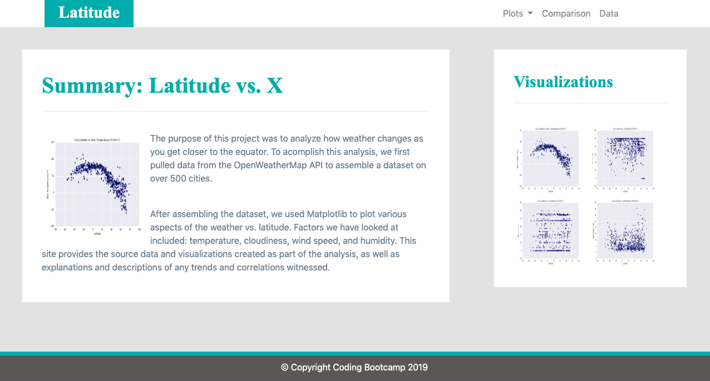

# HTMLandCSS
Designing a website with data on global latitude and climate attributes with html and css to prove whether temperatures are warmest near the equator. Linked to the data procured within ````markgat/PythonWeatherAPI````

Click  to access the application remotely.
## Getting Started
### Installing
1) Git clone the repository to your local machine:
    ````
    $ git clone https://github.com/markgat/HTMLandCSS.git
    ````
2) To access application locally, open ````index.html```` with browser
3) Navigate the site or trend observation, graphed plots, and complete table of data collection!